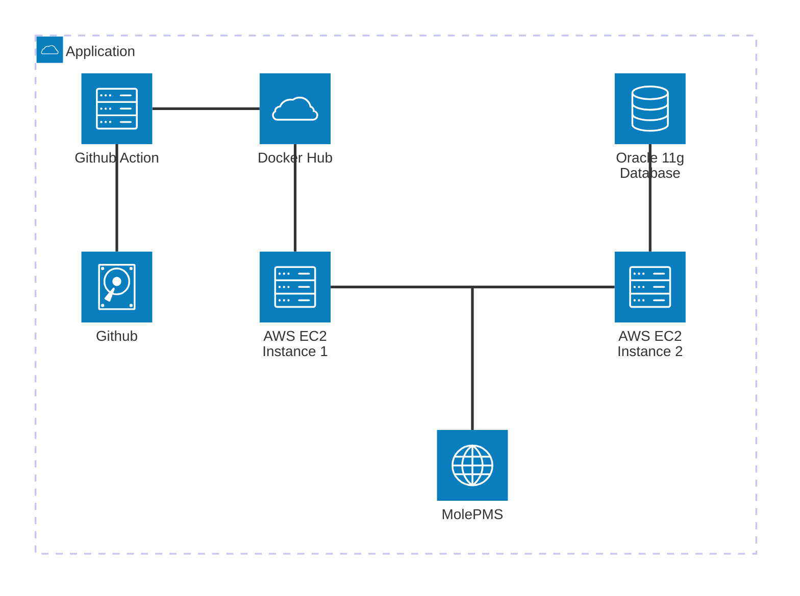

# Mole PMS
*' 프로젝트중 나오는 Issue를 MoldPMS와 함께 두더지게임 처럼 잡아내기! '*

**프로젝트 설명 :** 문서,일정,이슈를 한번에 볼수있는 프로젝트 진행 통합관리 시스템
<br>
#### 팀원 
**김정현(Lead)**
- 서버 구축 / 관리 (AWS EC2)
- 일정 관리

**김재욱 (Devops)**
- UI / UX Design (Figma, HTML, CSS)
- CI / CD Pipeline 구축 (Github Actions)
- GIT VCS 최신화 관리

**박민수 (Software Engineer)**
- Database 구축 SQL Command Line 설계 (Oracle)
- Frontend 구현 (HTML, JS, CSS)

**차성호 (Software Engineer)**
- Backend JSP 설계, 구현 (JAVA)
- Database 구조 설계 (Oracle)
- 데이터 암호화, 보안관리

<br><br>
**사용 기술 :** Java (JDK 21),  JavaScript,  HTML5,  CSS,  Oracle Database 11g,  AWS ec2,  Tomcat 9. Docker
<br>

# CI / CD Pipeline
### Github Action
- Auto Pull Request @  peter-evans/create-pull-request
- Java Build to War @ Maven & upload war artifact

**구현 방식 설명:** JSP와 AJAX를 활용한 SSR(Sever Side Rendering) Web Project 이다. 
1. Github Action 을 이용하여 자동으로 Pull Request 개설, 해당 풀리퀘스트를 확인 후 병합
2. Master Branch에 Push 가 있을 경우 Maven 을 이용한 WAR (Tomcat 확장자) 파일로 빌드
3. War 파일을 포함 Tomcat Docker를 구성 Docker hub에 Push
4. EC2 서버에서 Docker hub에 Docker Image 를 Pull 후 컨테이너 생성
5. Github Action 에서 SSH 커넥션을 이용하여 자동으로 Tomcat서버를 종료 후 재실행

# 서버 구조

AWS EC2 Instance 2개 
- Oracle 11g Server Docker 1개
- Deploy용 Tomcat 9 Server Docker 1개




# Commit Type

타입은 태그와 제목으로 구성되고, 태그는 영어로 쓰되 첫 문자는 대문자로 한다.

**`태그 : 제목`의 형태이며, `:`뒤에만 space가 있음에 유의한다.**

- `feat` : 새로운 기능 추가
- `fix` : 버그 수정
- `docs` : 문서 수정
- `style` : 코드 포맷팅, 세미콜론 누락, 코드 변경이 없는 경우
- `refactor` : 코드 리펙토링
- `test` : 테스트 코드, 리펙토링 테스트 코드 추가
- `chore` : 빌드 업무 수정, 패키지 매니저 수정

# Subject

- 제목은 최대 50글자가 넘지 않도록 하고 마침표 및 특수기호는 사용하지 않는다.
- 영문으로 표기하는 경우 동사(원형)를 가장 앞에 두고 첫 글자는 대문자로 표기한다.(과거 시제를 사용하지 않는다.)
- 제목은 **개조식 구문**으로 작성한다. --> 완전한 서술형 문장이 아니라, 간결하고 요점적인 서술을 의미.

```jsx
* Fixed --> Fix
* Added --> Add
* Modified --> Modify

```

