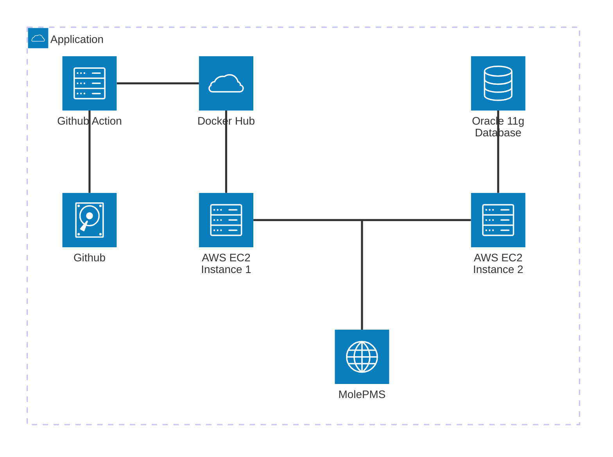

# Mole PMS
*' 프로젝트중 나오는 Issue를 MoldPMS와 함께 두더지게임 처럼 잡아내기! '*

Link : molepms.github.io/MolePMS

**프로젝트 설명 :** 문서,일정,이슈를 한번에 볼수있는 프로젝트 진행 통합관리 시스템
<br>
#### 팀원 
**김정현(Lead)**
- 서버 구축 / 관리 (AWS EC2)
- 일정 관리

**김재욱 (Devops)**
- UI / UX Design (Figma, HTML, CSS)
- CI / CD Pipeline 구축 (Github Actions)
- GIT VCS 최신화 관리

**박민수 (Software Engineer)**
- Database 구축 SQL Command Line 설계 (Oracle)
- Frontend 구현 (HTML, JS, CSS)

**차성호 (Software Engineer)**
- Backend JSP 설계, 구현 (JAVA)
- Database 구조 설계 (Oracle)
- 데이터 암호화, 보안관리

<br><br>
**사용 기술 :** Java (JDK 21),  JavaScript,  HTML5,  CSS,  Oracle Database 11g,  AWS ec2,  Tomcat 9. Docker
<br>

# CI / CD Pipeline
### Github Action
- Auto Pull Request @  peter-evans/create-pull-request
- Java Build to War @ Maven & upload war artifact

**구현 방식 설명:** JSP와 AJAX를 활용한 SSR(Sever Side Rendering) Web Project 이다. 
1. Github Action 을 이용하여 자동으로 Pull Request 개설, 해당 풀리퀘스트를 확인 후 병합
2. Master Branch에 Push 가 있을 경우 Maven 을 이용한 WAR (Tomcat 확장자) 파일로 빌드
3. War 파일을 포함 Tomcat Docker를 구성 Docker hub에 Push
4. EC2 서버에서 Docker hub에 Docker Image 를 Pull 후 컨테이너 생성
5. Github Action 에서 SSH 커넥션을 이용하여 자동으로 Tomcat서버를 종료 후 재실행

# 서버 구조

AWS EC2 Instance 2개 
- Oracle 11g Server Docker 1개
- Deploy용 Tomcat 9 Server Docker 1개



# 데이터 암호화

**SALT** 보안 방식을 채택하여 구현시도.

**SALT 방식이란?**
사용자의 비밀번호를 해싱(Hashing)하는 과정에서 고유한 랜덤 데이터(Salt)를 추가하여 고유한 해시값을 생성하는 방식

**SALT 방식의 채택 사유**
SALT 방식은 Brute-Force 공격과 Rainbow-Table 공격에 대해 어느정도 대비가 되기에 강력한 보안 방법이라 생각하여 채택함.

# Github Pages를 이용한 도메인 링크 사용

단기적 미니프로젝트에 대하여 별도의 도메인을 구매하는것이 비용적으로 효율이 떨어진다 생각하여 Github Pages 에서 제공되는 Github.io 링크를 이용하여 **접속 링크를 대체**하는 방식을 사용하였습니다.

**구현 방식**
	Github Pages 는 Github에서 제공하는 정적 웹 호스팅 서비스로 (*Username.Github.io*)라는 링크를 지원합니다. 
	이를 이용하여 저희는 html의 refresh 메타 태그를 이용해 사용자가 접근하기 간편한 링크를 사용하기로 하엿습니다.
	
```HTML
<!DOCTYPE html>
<html lang="en">
<head>
    <meta charset="UTF-8">
    <meta name="viewport" content="width=device-width, initial-scale=1.0">
    <title>Mole PMS</title>
    <meta http-equiv="refresh" content="3;url=Redirection Link">
    <meta property="og:image" content="wall.png">
~생략~
```

http-equiv=refresh 를 이용할경우 0초의 시간을 지정해도 중간에 하얀 화면이 깜빡거릴수밖에 없기에 오히려 이를 이용하여 3초간의 애니메이션이 포함된 로딩페이지를 만들어 사용자의 위화감을 줄였습니다.

# CSS JS 를 이용한 모달창 구현

JSP 프로젝트를 진행하며 어느정도 페이지가 동적이게 보이도록 하고싶었기에. JS 와 CSS 를 이용하여 팝업을 구현하기로 하였습니다

```js
    var popup = document.getElementById("popup-signup");
    popup.style.visibility = "visible";
    popup.style.opacity = "1";  
```

css를 별도로 정의하여 화면 가운데에 나올 수 있게 정의 후
js 스크립트로 popup 기능을 만들어 각 팝업창을 getElementById 를 이용하여 지정해준후 style.visibility를 조정하여 모달창을 구현하였습니다.
# Commit Type

타입은 태그와 제목으로 구성되고, 태그는 영어로 쓰되 첫 문자는 대문자로 한다.

**`태그 : 제목`의 형태이며, `:`뒤에만 space가 있음에 유의한다.**

- `feat` : 새로운 기능 추가
- `fix` : 버그 수정
- `docs` : 문서 수정
- `style` : 코드 포맷팅, 세미콜론 누락, 코드 변경이 없는 경우
- `refactor` : 코드 리펙토링
- `test` : 테스트 코드, 리펙토링 테스트 코드 추가
- `chore` : 빌드 업무 수정, 패키지 매니저 수정

# Subject

- 제목은 최대 50글자가 넘지 않도록 하고 마침표 및 특수기호는 사용하지 않는다.
- 영문으로 표기하는 경우 동사(원형)를 가장 앞에 두고 첫 글자는 대문자로 표기한다.(과거 시제를 사용하지 않는다.)
- 제목은 **개조식 구문**으로 작성한다. --> 완전한 서술형 문장이 아니라, 간결하고 요점적인 서술을 의미.

```jsx
* Fixed --> Fix
* Added --> Add
* Modified --> Modify

```

